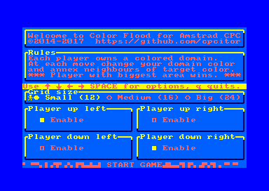
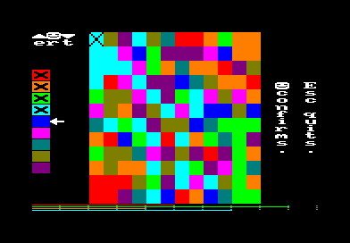
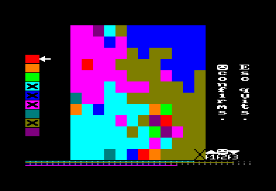
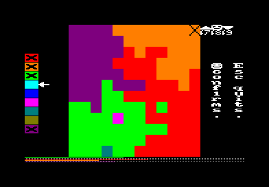
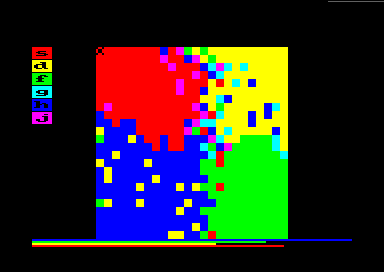
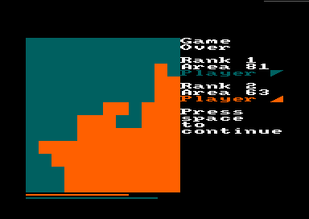
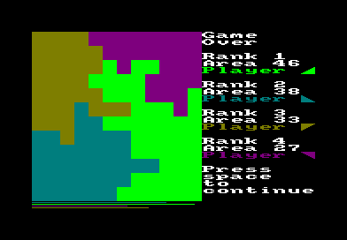

# Color Flood

By [cpcitor](https://github.com/cpcitor)

Coded in C + SDCC + [cpc-dev-tool-chain](https://github.com/cpcitor/cpc-dev-tool-chain)

Build status | Linux result
---- | ----
Full build: SDCC cross-compiler + binutils + tape/disk image tools + tape/disk images + audio file | 

# Principle of the game

A puzzle game for 2 to 4 player.

* Each player owns a colored domain.
* At each move change your domain color and annex neighbours of target color.
* When no more moves are possible, *player with biggest area wins.*

What makes the game somewhat interesting is that it's sometimes good
to play not what is the best for you (sometimes nothing is really
better than another) but playing what will slow down your opponent.

# How to use

## First screen

Use cursor keys to select your options :

* grid size 12x12 16x16 or 24x24
* which corners are occupied by an active player.

## Game screen

* The next player to play is shown with a cross in the corner.
* Each player has their own 3 keys to choose the next color (top left
  player near keyboard top left, and so on).
* Press up/down keys until you get your preferred color, then confirm.

At the bottom, progress bars allow to compare surface of each player
(easier than trying to count squares).

Illustration: in game with 4 players.

Illustration: older release, 4 players, 6 colors instead of 9.

## Game end

The program shows the final area of each players.
Sometimes there are draw games.

Illustration: 2 players end screen

Illustration: 4 players end screen

# How to compile

* Linux users will recognize the usual clone/configure/make workflow.  Dependencies may already be there, or as simple to get as running this command line: `sudo apt-get --no-install-recommends --assume-yes install git ca-certificates wget make patch gcc bzip2 unzip g++ texinfo bison flex libboost-dev libsdl1.2-dev pkgconf libfreetype6-dev libncurses-dev` [details](https://github.com/cpcitor/cpc-dev-tool-chain/blob/master/documentation/how_to_install.md#do-i-need-to-prepare-my-system- "Do I need to prepare my system ?").
* Windows users have to fetch a Linux-like environment first.  Details on [How to install](https://github.com/cpcitor/cpc-dev-tool-chain/blob/master/documentation/how_to_install.md).

For a quick start, just copy-paste this!

<pre>
git clone https://github.com/cpcitor/color-flood-for-amstrad-cpc
cd color-flood-for-amstrad-cpc
./configure_cdtc_build_tree.sh
make    # on Linux, try "make run" it will even run the project on caprice32 emulator!
# While the project compiles, read on.
</pre>

This fetches dependencies (cross-compiler, tools, etc), builds then generates `cf2.dsk` that you can use in an emulator:

* [on Linux](http://cpcwiki.eu/index.php/Emulators#Unix_.2F_Linux "Emulators - CPCWiki") for example [caprice32](https://github.com/ColinPitrat/caprice32 "caprice32"),
* [on Windows](http://cpcwiki.eu/index.php/Emulators#Windows "Emulators - CPCWiki") for example [WinAPE](http://www.winape.net/ "WinAPE : Windows Amstrad Plus Emulator"),
* [emulators for all platforms](http://cpcwiki.eu/index.php/Emulators) (mobile, etc)
* or transfer to real CPC, for example with a specific audio cable `make au ; mplayer *.au`. Enjoy!

## Options for compilation

### Speed up compilation?

HUGE speed bost if your PC has e.g. 8 cores (or even 4 multi-threaded cores):

<pre>
	make -j8
</pre>

### Generate audio file, others?

Try different targets:

<pre>
	make run	# Linux only at the moment: runs project in caprice32 emulator.
	make dsk	# Disk file for emulator, can be written to real floppies.
	make cdt	# Tape file for emulator, can be converted to audio.
	make wav	# Generate audio file (also voc au)
</pre>

### Already have a working [cpc-dev-tool-chain](https://github.com/cpcitor/cpc-dev-tool-chain)?

If you already have a copy of [cpc-dev-tool-chain](https://github.com/cpcitor/cpc-dev-tool-chain), you can avoid automatic fetch+compile of another one.

Use the configure script to tell where it is:

	./configure_cdtc_build_tree.sh /path/to/cpc-dev-tool-chain

You can also

	/path/to/cpc-dev-tool-chain/cdtc-project-setup.sh .
