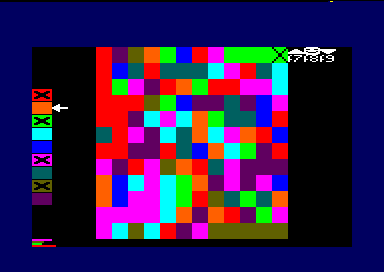
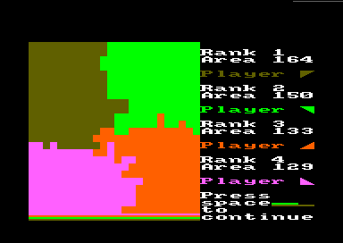

# Color Flood

By [cpcitor](https://github.com/cpcitor)

Coded in C + SDCC + [cpc-dev-tool-chain](https://github.com/cpcitor/cpc-dev-tool-chain)

# Principle of the game

A puzzle game for 2 to 4 player.

* Each player owns a colored domain.
* At each move change your domain color and annex neighbours of target color.
* When no more moves are possible, *player with biggest area wins.*

What makes the game somewhat interesting is that it's sometimes good
to play not what is the best for you (sometimes nothing is really
better than another) but playing what will slow down your opponent.

# How to use

## First screen

Use cursor keys to select your options :

* grid size 12x12 16x16 or 24x24
* which corners are occupied by an active player.

## Game screen

* The next player to play is shown with a cross in the corner.
* Each color is associated with a key in the set s d f g h j.
* Choose the color you want and press the associated key.  Be careful, no undo!

At the bottom, progress bars allow to compare surface of each player
(easier than trying to count squares).

Illustration: in game with 4 players.

Illustration: older release, 4 players, 6 colors instead of 9.

## Game end

The program shows the final area of each players.
Sometimes there are draw games.

Illustration: 2 players end screen

Illustration: 4 players end screen

# How to compile

* Get [cpc-dev-tool-chain](https://github.com/cpcitor/cpc-dev-tool-chain) as explained on [How to install](https://github.com/cpcitor/cpc-dev-tool-chain/blob/master/documentation/how_to_install.md) (mostly `git clone ; make`).
* Get and compile color flood source code
<pre>
git clone https://github.com/cpcitor/color-flood-for-amstrad-cpc
cd color-flood-for-amstrad-cpc ; /path/to/cpc-dev-tool-chain/cdtc-project-setup.sh .
make 	# also possible: make cdt dsk wav au
</pre>
* Run the cdt or dsk in an emulator ([on Linux](http://cpcwiki.eu/index.php/Emulators#Unix_.2F_Linux "Emulators - CPCWiki") for example [caprice32](https://github.com/ColinPitrat/caprice32 "caprice32"), [on Windows](http://cpcwiki.eu/index.php/Emulators#Windows "Emulators - CPCWiki") for example [WinAPE](http://www.winape.net/ "WinAPE : Windows Amstrad Plus Emulator"), [others](http://cpcwiki.eu/index.php/Emulators)) or transfer to real CPC, for example with a specific audio cable `make au ; mplayer *.au`. Enjoy!
